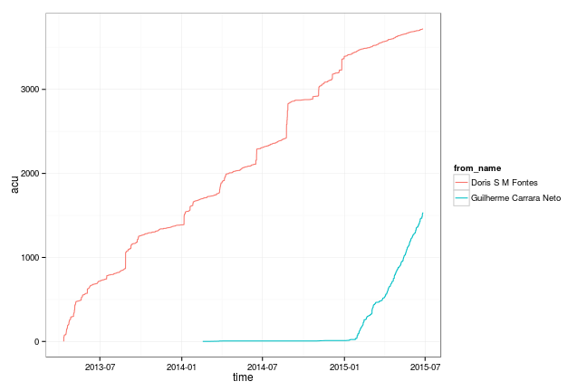

# statjobs

Pesquisa Statjobs usando Graph API do Facebook

## Instalação

Este pacote não está disponível no CRAN. Para instalá-lo, utilize o pacote `devtools`, fazendo

```
devtools::install_github('conre3/statjobs')
```

## Pequeno manual de utilização

- Pegue um **access token** temporário na página https://developers.facebook.com/tools/explorer (um código enorme)
- rode

```
at <- 'codigo enorme'
lista <- statjobs::baixa_posts(at)
dados <- statjobs::arruma_posts(lista)
```

O pacote já vem com uma base baixada em 2015-06-25. Para carregar, rode

```
data(posts, package = 'statjobs')
```

Divirta-se ;)

# Analise inicial

```r
library(dplyr)
library(tidyr)
library(stringr)
library(ggplot2)
library(statjobs)
library(lubridate)
```

## Analisando evolucao da Doris e do Guilherme no grupo


```r
posts %>%
  filter(from_name %in% c('Doris S M Fontes', 'Guilherme Carrara Neto')) %>%
  mutate(time = ymd_hms(created_time)) %>%
  arrange(time) %>%
  group_by(from_name) %>%
  mutate(um = 1, acu = cumsum(um)) %>%
  ungroup %>%
  ggplot(aes(x = time, y = acu, colour = from_name)) +
  geom_line() +
  theme_bw()
```

 

## Analisando as mensagens

Tipos de posts


```r
posts %>%
  count(type, sort = TRUE) %>%
  mutate(` %` = round(n/sum(n) * 100, 2))
```

```
## Source: local data frame [5 x 3]
## 
##     type    n     %
## 1   link 3101 54.19
## 2 status 2501 43.71
## 3  photo  108  1.89
## 4  video   11  0.19
## 5  event    1  0.02
```

Note que são dois tipos de posts principais, status e links. Vamos analisar
separadamente.


```r
status <- posts %>% 
  filter(type %in% 'status')

link <- posts %>% 
  filter(type %in% 'link')
```

Em relação aos status, podemos notar que existe uma grande quantidade de
vagas do site www:.vagas.com.br


```r
status %>%
  mutate(vagas = str_detect(message, 'www\\.vagas\\.com\\.br')) %>%
  count(vagas, sort = TRUE)
```

```
## Source: local data frame [3 x 2]
## 
##   vagas    n
## 1 FALSE 1571
## 2  TRUE  923
## 3    NA    7
```

Geralmente, os posts desse site contém um padrão conhecido.


```r
aux <- status %>%
  mutate(vagas = str_detect(message, 'www\\.vagas\\.com\\.br')) %>%
  filter(vagas) %>%
  slice(1) %>% 
  select(from_name, message) %>% 
  sapply(function(x) {cat(x); cat('\n\n@@@@@@@\n\n')})
```

```
## Guilherme Carrara Neto
## 
## @@@@@@@
## 
## Latin America Strategic Workforce Planning Coordinator (GE - General Electric)
## Nível hierárquico:Supervisão/Coordenação
## Local:São Paulo / SP / BR
## Quantidade de vagas:1
## 
## Role Summary/Purpose 
## We are looking for a Strategic Workforce Planning Coordinator to join a growing team focused on delivering a data-driven consultative experience to internal business clients. Through consultative engagements, the SWP team quantifies and assesses the supply and demand of talent required to successfully inform and execute business strategy.
## 
## Essential Responsibilities 
## The SWFP Coordinator would be engaged in developing and delivering insights for complex workforce planning projects and programs using inputs from a variety of data sources, business leaders and HR Business Partners. This role will drive the projects derived from the WPF analysis. Areas of concentration include consulting, project management, headcount forecasting, scenario planning, and gap analysis.
## Consult with business partners to identify workforce needs, develop hypotheses and execute related quantitative analyses, (e.g. attrition, retirement, and movement)
## Lead the development of a compelling story through data and transform complex data elements into a consumable format for various levels of management.
## Synthesize analyses through activities into comprehensive presentations to foster discussion and communicate key insights.
## Identify and incorporate multiple data elements to support analysis. Facilitate conversations with data owners to ensure proper utilization and management of the data.
## Execute research and analysis and interpret findings to support the identification of solutions that address organizational gaps.
## Lead all the project management activities to ensure the thorough execution of special projects derives from WFP analysis. Continued development of key data sources, tools, templates and processes.
## 
## Qualifications/Requirements 
## Bachelor's degree in economics, Mathematics, Statistics, human resources or a related field.
## 3-7 years of analytical and/or consulting experience.
## strong data management skills
## Demonstrated ability to apply consultative mind-set, problem-solving and critical thinking.
## Team player with strong interpersonal and executive communication.
## Ability to balance multiple priorities simultaneously and meet deadlines as required.
## Proficiency in Microsoft Office Suite (Word, Excel, Access, PowerPoint, Plateu, Datamanagement)
## 
## Desired Characteristics 
## Strategic workforce planning experience
## Statistic and project management experience.
## 
## http://www.vagas.com.br/vagas/v1195884/latin-america-strategic-workforce-planning-coordinator
## 
## @@@@@@@
```

Algumas informações úteis que podem ser extraídas:

- Nível hierárquico
- Nome da vaga (analista, estatístico, etc)
- Atividades
- Requisitos


```r
antes <- c('([^a-zA-Z]|^)formacao\\:?\n?( e pre\\-requisitos\\:)?',
           'academica\\:?\n?',
           '([^a-zA-Z]|^)cursar',
           '([^a-zA-Z]|^)curso\\:?',
           'superior',
           'graduacao')
re <- sprintf('(%s)([^\n]+)', paste(antes, collapse = '|'))
vagas <- status %>%
  mutate(vagas = str_detect(message, 'www\\.vagas\\.com\\.br')) %>%
  filter(vagas) %>%
  mutate(nivel = str_match(message, 'Nível hierárquico\\:([^\n]+)\n')[, 2]) %>%
  mutate(local = str_match(message, 'Local\\:([^\n]+)\n')[, 2]) %>%
  mutate(req = str_match(message, regex('req[^:]+\\:([^|]+)',
                                        ignore_case = TRUE))[, 2]) %>%
  mutate(form = str_match(tolower(tjsp::rm_accent(message)), re)[, 7])
```

Em relação ao nível hierárquico, temos o seguinte resultado:


```r
vagas %>%
  count(nivel, sort = TRUE) %>%
  mutate(` %` = round(n/sum(n) * 100, 2)) %>%
  knitr::kable()
```


|nivel                  |   n|     %|
|:----------------------|---:|-----:|
|Estágio                | 221| 23.94|
|Pleno                  | 212| 22.97|
|Júnior/Trainee         | 199| 21.56|
|Sênior                 | 189| 20.48|
|Supervisão/Coordenação |  43|  4.66|
|Auxiliar/Operacional   |  25|  2.71|
|NA                     |  17|  1.84|
|Gerência               |  13|  1.41|
|Técnico                |   4|  0.43|

Em relação ao local, temos:


```r
vagas %>%
  count(local, sort = TRUE) %>%
  mutate(` %` = round(n/sum(n) * 100, 2)) %>%
  head(10) %>%
  knitr::kable()
```


|local                             |   n|     %|
|:---------------------------------|---:|-----:|
|São Paulo / SP / BR               | 274| 29.69|
|Rio de Janeiro / RJ / BR          | 130| 14.08|
|Curitiba / PR / BR                |  38|  4.12|
|Rio de Janeiro / RJ / BR - Centro |  30|  3.25|
|Belo Horizonte / MG / BR          |  27|  2.93|
|NA                                |  24|  2.60|
|Barueri / SP / BR                 |  20|  2.17|
|Brasil                            |  19|  2.06|
|São Paulo / BR                    |  17|  1.84|
|Campinas / SP / BR                |  16|  1.73|

O grafico abaixo mostra quais os termos mais frequentes quando se fala em formação.


```r
# aux <- vagas %>%
#   sample_n(1) %>% 
#   select(from_name, message, form) %>% 
#   sapply(function(x) {cat(x); cat('\n\n@@@@@@@\n\n')})

cursos <- vagas %>%
  filter(!is.na(form)) %>%
  mutate(matematica = ifelse(str_detect(form, 'matematica'), 'matematica', NA)) %>%
  mutate(contabeis = ifelse(str_detect(form, 'ciencias cont|contab'), 
                            'ciencias contabeis', NA)) %>%
  mutate(engenharia = ifelse(str_detect(form, 'engenharia'), 'engenharia', NA)) %>%
  mutate(economia = ifelse(str_detect(form, 'economia'), 'economia', NA)) %>%
  mutate(financas = ifelse(str_detect(form, 'financas'), 'financas', NA)) %>%
  mutate(atuaria = ifelse(str_detect(form, 'atuari'), 'atuaria', NA)) %>%
  mutate(administracao = ifelse(str_detect(form, 'admin'), 'administracao', NA)) %>%
  mutate(marketing = ifelse(str_detect(form, 'marketing'), 'marketing', NA)) %>%
  mutate(informatica = ifelse(str_detect(form, 'inform|compu'), 'informatica', NA)) %>%
  mutate(estatistica = ifelse(str_detect(form, 'estat'), 'estatistica', NA))
  
cursos %>%
  summarise_each(funs(sum(!is.na(.))), matematica:estatistica) %>%
  gather() %>%
  ggplot(aes(x = reorder(key, X = value), y = value, fill = key)) +
  geom_bar(stat = 'identity') +
  guides(fill = FALSE) +
  theme_bw() +
  xlab('formacao') +
  ylab('quantidade') +
  theme(axis.text.x = element_text(angle = 45, hjust = 1, size = 12))
```

 

O grafico abaixo mostra quais os termos mais frequentes quando se fala em formação,
apenas quando aparece o nome "estatistica".


```r
cursos %>%
  filter(!is.na(estatistica)) %>%
  summarise_each(funs(sum(!is.na(.))), matematica:estatistica) %>%
  gather() %>%
  mutate(value = value / value[key=='estatistica']) %>%
  filter(key != 'estatistica') %>%
  ggplot(aes(x = reorder(key, X = value), y = value, fill = key)) +
  geom_bar(stat = 'identity') +
  guides(fill = FALSE) +
  theme_bw() +
  scale_y_continuous(labels = scales::percent, breaks = 0:10/10) +
  xlab('formacao') +
  ylab('proporcao') +
  theme(axis.text.x = element_text(angle = 45, hjust = 1, size = 12))
```

 

TODO

- Pegar atividades
- Pegar requisitos
- Pegar desejáveis

